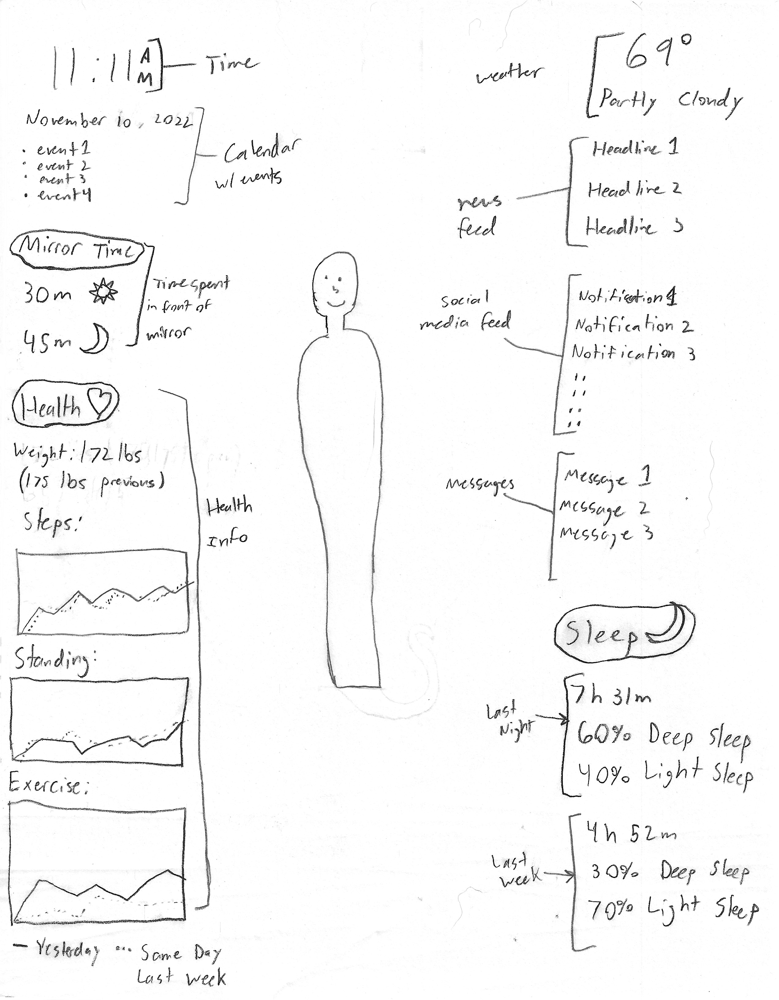
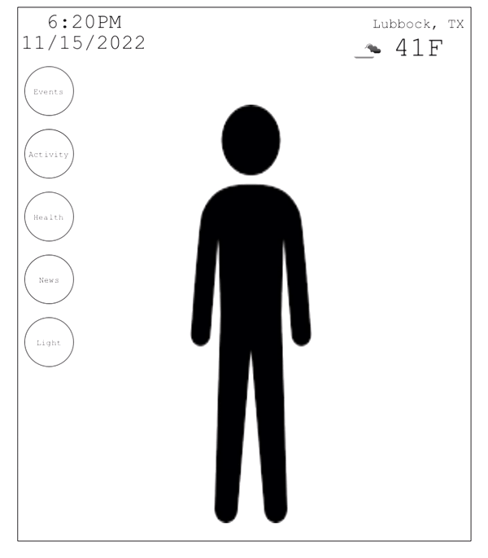

**Links**

[GitHub Repository](https://github.com/MichaelGumm/p2.Michael.Gumm)

[Presentation Page](https://michaelgumm.github.io/p2.Michael.Gumm/)

**Sketch**

My original plan for the interface of the mirror. I wanted to leave the middle open so the mirror can still function well as a mirror, so all of the information was to be displayed on the sides of the interface. As I began working on the final project, I made some redesigns to improve visibility of the interface and to keep it uncluttered. I was able to condense the information into widgets that only display the desired information once clicked. Because of this, I was able to keep the widgets on one side and free up even more open space. Some information, such as Sleep and Exercise was omitted to focus on more necessary data and not to overload the user with information.

**Final Design**

**Functionality:**

As a general overview of the layout, the final design displays the current date and time in the top left corner, as well as the current weather and temperature in the top right corner. On the left side of the interface are five buttons that display various information or carry out specific functions.

The Events button loads data from the corresponding .JSON file and displays the information in a black box drawn when the button is pressed. Clicking anywhere else on the interface will close the Events popup.

The Activity button displays the user’s time spent in front of the mirror, separated into day activity and night activity. Clicking anywhere else on the interface will close the Activity popup.

The Health button loads data from the corresponding .JSON file, such as the user’s current weight, and their weight on the same day of last week. It then displays this data in a black popup that appears when the button is clicked. Clicking anywhere else on the interface will close the Health popup.

The News button will load various articles from a .JSON file containing the data, and display it in a black popup that appears when the button is clicked. Clicking anywhere else on the interface will close the News popup.

Finally, the Light button will increment the currently active color for the lights on the outer border of the mirror. This is done by using an array to store the various possible color values, then using the counter to cycle through them as the button is pressed. The possible color values are White (default), Red, Orange, Yellow, Green, Blue, Purple, and Pink.

The time is accurately acquired using Processing functions such as “hour()” and “minute()” to obtain the current time in a 24 hour format. Simple math is then used to convert this into the standard time using AM or PM.

The weather data is obtained through the use of openweathermap, a free to use weather api that returns a .JSON file of weather data when called. The program calls the api, then uses JSON parsing statements to select the necessary data such as current temperature and weather, then displays the data on the interface.

[Presentation](https://drive.google.com/file/d/1lxRZlSw1i1Yku7O6oo97WKgTIw6GtSnD/view?usp=sharing)
